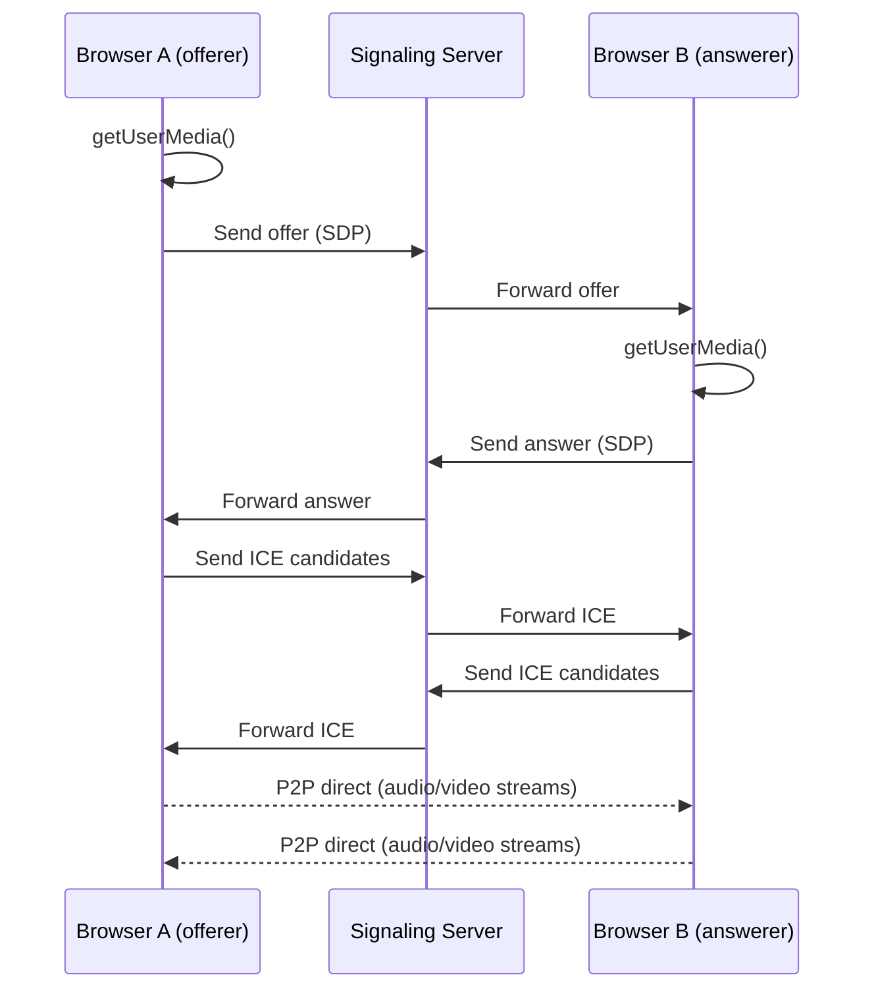

:::tip Browser Support
Chrome 56+ · Firefox 44+ · Safari 11+ · Edge 79+

**Note**: HTTPS environment or localhost required to run this example.
:::

## Overview

This section ties together everything covered: local media capture → connection creation → signaling exchange → remote video playback. Total: ~80 lines of code.

## Architecture Diagram



## Complete Code

### HTML Page

```html
<!DOCTYPE html>
<html lang="en">
<head>
  <meta charset="UTF-8" />
  <title>WebRTC Video Call</title>
  <style>
    body { margin: 0; display: flex; gap: 16px; padding: 16px; box-sizing: border-box; }
    video { width: 48%; border-radius: 8px; background: #000; }
    #controls { position: fixed; bottom: 24px; display: flex; gap: 12px; }
    button { padding: 10px 20px; border: none; border-radius: 6px; cursor: pointer; }
    #start { background: #646cff; color: white; }
    #hangup { background: #f43f5e; color: white; }
  </style>
</head>
<body>
  <video id="local" autoplay muted></video>
  <video id="remote" autoplay></video>

  <div id="controls">
    <button id="start">Call</button>
    <button id="hangup">Hang Up</button>
  </div>

  <script type="module" src="./app.js"></script>
</body>
</html>
```

### JavaScript (Signaling client + call logic)

```js
const ICE_SERVERS = [{ urls: 'stun:stun.l.google.com:19302' }];

// Replace with your WebSocket signaling server URL
const SIGNAL_URL = 'wss://your-signaling-server.com';

let signaling;

const localVideo  = document.getElementById('local');
const remoteVideo = document.getElementById('remote');
const startBtn    = document.getElementById('start');
const hangupBtn   = document.getElementById('hangup');

let pc = null;
let localStream = null;

function createPeerConnection() {
  pc = new RTCPeerConnection({ iceServers: ICE_SERVERS });

  pc.onicecandidate = (e) => {
    if (e.candidate) signaling.sendCandidate(e.candidate);
  };

  pc.ontrack = (e) => {
    remoteVideo.srcObject = e.streams[0];
  };

  pc.onconnectionstatechange = () => {
    console.log('Connection state:', pc.connectionState);
  };

  return pc;
}

async function startLocalStream() {
  localStream = await navigator.mediaDevices.getUserMedia({ video: true, audio: true });
  localVideo.srcObject = localStream;
}

// === Offer side ===
async function call() {
  await startLocalStream();
  createPeerConnection();

  localStream.getTracks().forEach((track) => {
    pc.addTrack(track, localStream);
  });

  const offer = await pc.createOffer();
  await pc.setLocalDescription(offer);

  signaling.sendOffer(pc.localDescription);
}

// === Answer side ===
async function answer(offer) {
  await startLocalStream();
  createPeerConnection();

  localStream.getTracks().forEach((track) => {
    pc.addTrack(track, localStream);
  });

  await pc.setRemoteDescription(offer);
  const answer = await pc.createAnswer();
  await pc.setLocalDescription(answer);

  signaling.sendAnswer(pc.localDescription);
}

// === ICE candidate handling ===
async function handleCandidate(candidate) {
  if (!pc) return;
  await pc.addIceCandidate(candidate);
}

// === Hang up ===
function hangup() {
  localStream?.getTracks().forEach((t) => t.stop());
  pc?.close();
  pc = null;
  localStream = null;
  localVideo.srcObject = null;
  remoteVideo.srcObject = null;
  console.log('Call ended');
}

// === Minimal signaling (demo only) ===
signaling = {
  sendOffer(offer) {
    console.log('[Signal] Sending offer (use WebSocket server to forward)', offer.sdp);
  },
  sendAnswer(answer) {
    console.log('[Signal] Sending answer (use WebSocket server to forward)', answer.sdp);
  },
  sendCandidate(candidate) {
    console.log('[Signal] Sending ICE candidate', candidate);
  },
};

startBtn.onclick = () => call();
hangupBtn.onclick = () => hangup();
```

## Quick Signaling Server Setup

The `signaling` object above just logs to console. Here are quick options to make it work:

### Option 1: PeerJS (easiest)

```bash
npm install peer
```

```js
// Server (Node.js)
import { PeerServer } from 'peer';
PeerServer({ port: 9000, path: '/myapp' });

// Client
import { Peer } from 'peer';
const peer = new Peer('some-unique-id');

peer.on('open', (id) => {
  signaling.sendOffer = (offer) => peer.send(JSON.stringify(offer));
});
```

### Option 2: WebSocket Server (Node.js + ws)

```js
// server.js (Node.js)
import { WebSocketServer } from 'ws';
const wss = new WebSocketServer({ port: 8080 });

const rooms = {};

wss.on('connection', (ws) => {
  ws.on('message', (data) => {
    const msg = JSON.parse(data);
    rooms[msg.room]?.forEach((client) => {
      if (client !== ws) client.send(data);
    });
  });
});
```

## Notes

- **HTTPS**: Required outside localhost; use ngrok or Cloudflare Tunnel to expose local services
- **STUN server**: `stun.l.google.com:19302` is Google's public STUN, for demo only; use your own or a paid TURN service in production
- **TURN relay**: In strict network environments (enterprise, symmetric NAT), STUN is insufficient; TURN server is required, otherwise connection will `failed`
- **Echo**: The local video has `muted` and remote audio doesn't — if there's still echo, check system audio settings or use headphones
