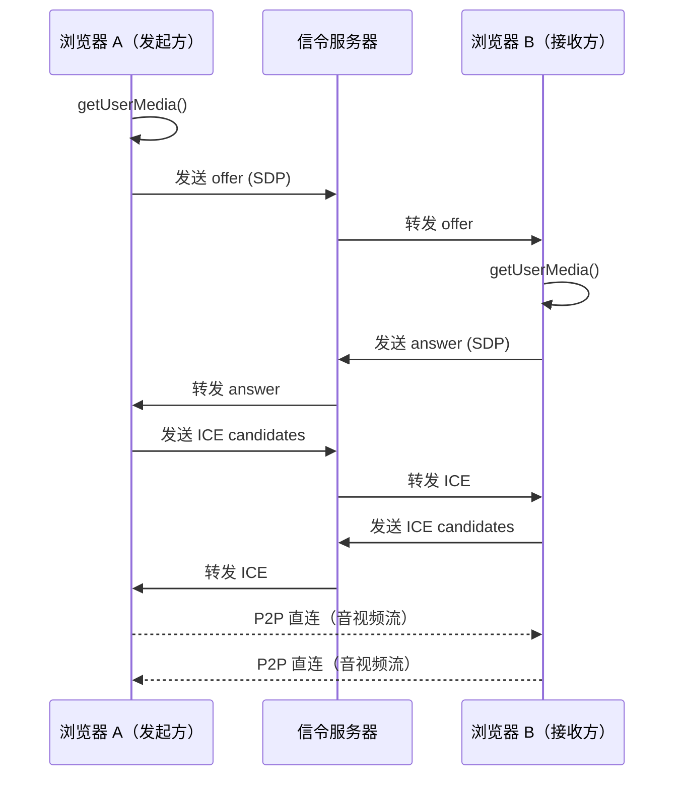

:::tip 浏览器支持
Chrome 56+ · Firefox 44+ · Safari 11+ · Edge 79+

**注意**：需要 HTTPS 环境或 localhost 才可运行本示例。
:::

## 概述

这一节我们把前面的知识串联起来：本地媒体采集 → 创建连接 → 信令交换 → 远端视频播放。整个流程拢共 80 行代码。

## 架构图



## 完整代码

### HTML 页面

<!-- index.html -->
```html
<!DOCTYPE html>
<html lang="zh">
<head>
  <meta charset="UTF-8" />
  <title>WebRTC 视频通话</title>
  <style>
    body { margin: 0; display: flex; gap: 16px; padding: 16px; box-sizing: border-box; }
    video { width: 48%; border-radius: 8px; background: #000; }
    #controls { position: fixed; bottom: 24px; display: flex; gap: 12px; }
    button { padding: 10px 20px; border: none; border-radius: 6px; cursor: pointer; }
    #start { background: #646cff; color: white; }
    #hangup { background: #f43f5e; color: white; }
  </style>
</head>
<body>
  <video id="local" autoplay muted></video>
  <video id="remote" autoplay></video>

  <div id="controls">
    <button id="start">发起通话</button>
    <button id="hangup">挂断</button>
  </div>

  <script type="module" src="./app.js"></script>
</body>
</html>
```

### JavaScript（信令客户端 + 呼叫逻辑）

<!-- app.js -->
```js
// === app.js ===

const ICE_SERVERS = [{ urls: 'stun:stun.l.google.com:19302' }];

// 替换为你的 WebSocket 信令服务器地址
const SIGNAL_URL = 'wss://your-signaling-server.com';

// 替换为你的信令服务器实现，或用页内模拟双端
let signaling;

// DOM
const localVideo  = document.getElementById('local');
const remoteVideo = document.getElementById('remote');
const startBtn    = document.getElementById('start');
const hangupBtn   = document.getElementById('hangup');

// 当前 RTCPeerConnection
let pc = null;
let localStream = null;

/* ---------- 工具函数 ---------- */

function createPeerConnection() {
  pc = new RTCPeerConnection({ iceServers: ICE_SERVERS });

  // ICE 候选
  pc.onicecandidate = (e) => {
    if (e.candidate) signaling.sendCandidate(e.candidate);
  };

  // 远端轨道到来
  pc.ontrack = (e) => {
    remoteVideo.srcObject = e.streams[0];
  };

  // 连接状态
  pc.onconnectionstatechange = () => {
    console.log('连接状态:', pc.connectionState);
  };

  return pc;
}

async function startLocalStream() {
  localStream = await navigator.mediaDevices.getUserMedia({ video: true, audio: true });
  localVideo.srcObject = localStream;
}

/* ---------- 发起通话（Offer 端） ---------- */

async function call() {
  await startLocalStream();
  createPeerConnection();

  // 把本地轨道加入连接
  localStream.getTracks().forEach((track) => {
    pc.addTrack(track, localStream);
  });

  // 创建 offer
  const offer = await pc.createOffer();
  await pc.setLocalDescription(offer);

  signaling.sendOffer(pc.localDescription);
}

/* ---------- 接收通话（Answer 端） ---------- */

async function answer(offer) {
  await startLocalStream();
  createPeerConnection();

  localStream.getTracks().forEach((track) => {
    pc.addTrack(track, localStream);
  });

  await pc.setRemoteDescription(offer);
  const answer = await pc.createAnswer();
  await pc.setLocalDescription(answer);

  signaling.sendAnswer(pc.localDescription);
}

/* ---------- ICE 候选处理 ---------- */

async function handleCandidate(candidate) {
  if (!pc) return;
  await pc.addIceCandidate(candidate);
}

/* ---------- 挂断 ---------- */

function hangup() {
  localStream?.getTracks().forEach((t) => t.stop());
  pc?.close();
  pc = null;
  localStream = null;
  localVideo.srcObject = null;
  remoteVideo.srcObject = null;
  console.log('通话已结束');
}

/* ---------- 信令（最小实现） ---------- */

// 这里是示意代码。真实场景需要替换为真正的 WebSocket 信令服务器。
// 你可以用 https://github.com/alatten/peerjs 的 PeerServer 快速搭建。
signaling = {
  _onOffer: null,
  _onAnswer: null,
  _onCandidate: null,

  sendOffer(offer) {
    // 替换为真实 WebSocket 发送：ws.send(JSON.stringify({ type: 'offer', sdp: offer.sdp }));
    console.log('[信令] 发送 offer（请用 WebSocket 服务器转发）', offer.sdp);
  },
  sendAnswer(answer) {
    // 替换为真实 WebSocket 发送：ws.send(JSON.stringify({ type: 'answer', sdp: answer.sdp }));
    console.log('[信令] 发送 answer（请用 WebSocket 服务器转发）', answer.sdp);
  },
  sendCandidate(candidate) {
    // 替换为真实 WebSocket 发送：ws.send(JSON.stringify({ candidate }));
    console.log('[信令] 发送 ICE candidate', candidate);
  },
};

/* ---------- 按钮绑定 ---------- */

startBtn.onclick = () => call();
hangupBtn.onclick = () => hangup();
```

## 如何快速搭建信令服务器

`app.js` 里的 `signaling` 对象只是打印日志。要让它真正工作，有几个快速方案：

### 方案一：PeerJS（最省事）

```bash
npm install peer
```

```js
// 服务端（Node.js）
import { PeerServer } from 'peer';
PeerServer({ port: 9000, path: '/myapp' });

// 客户端
import { Peer } from 'peer';
const peer = new Peer('some-unique-id');

peer.on('open', (id) => {
  // 对方可以用这个 id 呼叫你
  signaling.sendOffer = (offer) => peer.send(JSON.stringify(offer));
});
```

### 方案二：自己写 WebSocket 服务器（Node.js + ws）

```js
// server.js（Node.js）
import { WebSocketServer } from 'ws';
const wss = new WebSocketServer({ port: 8080 });

const rooms = {}; // roomId -> [ws1, ws2]

wss.on('connection', (ws) => {
  ws.on('message', (data) => {
    const msg = JSON.parse(data);
    // 广播给同房间的其他人
    rooms[msg.room]?.forEach((client) => {
      if (client !== ws) client.send(data);
    });
  });
});
```

## 注意事项

- **HTTPS**：除 localhost 外必须 HTTPS，可以借助 ngrok 或 Cloudflare Tunnel 暴露本地服务
- **STUN 服务器**：`stun.l.google.com:19302` 是 Google 公共 STUN，仅用于演示；生产环境建议自建或购买 TURN 服务
- **TURN 中继**：在严格网络环境下（企业网、对称型 NAT），STUN 不够用，必须配 TURN 服务器，否则连接 `failed`
- **回音问题**：本示例中本地视频加了 `muted`，远端音频没加——如果仍有回音，检查系统声卡设置或使用耳机
